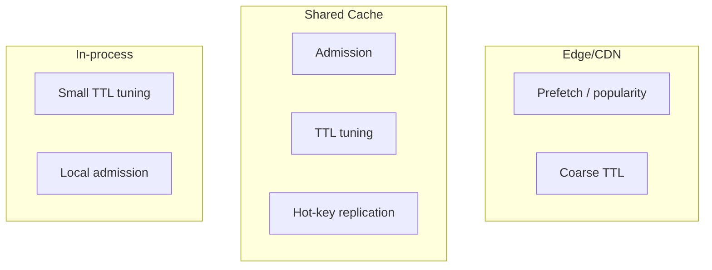
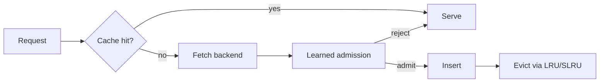
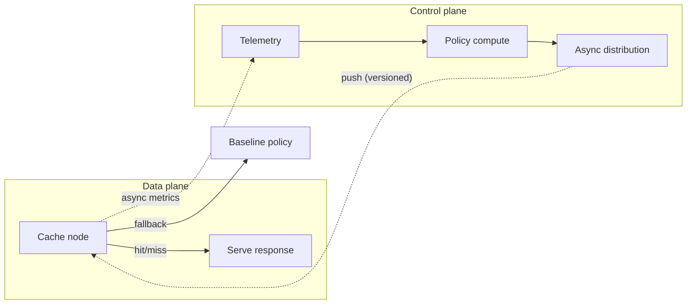
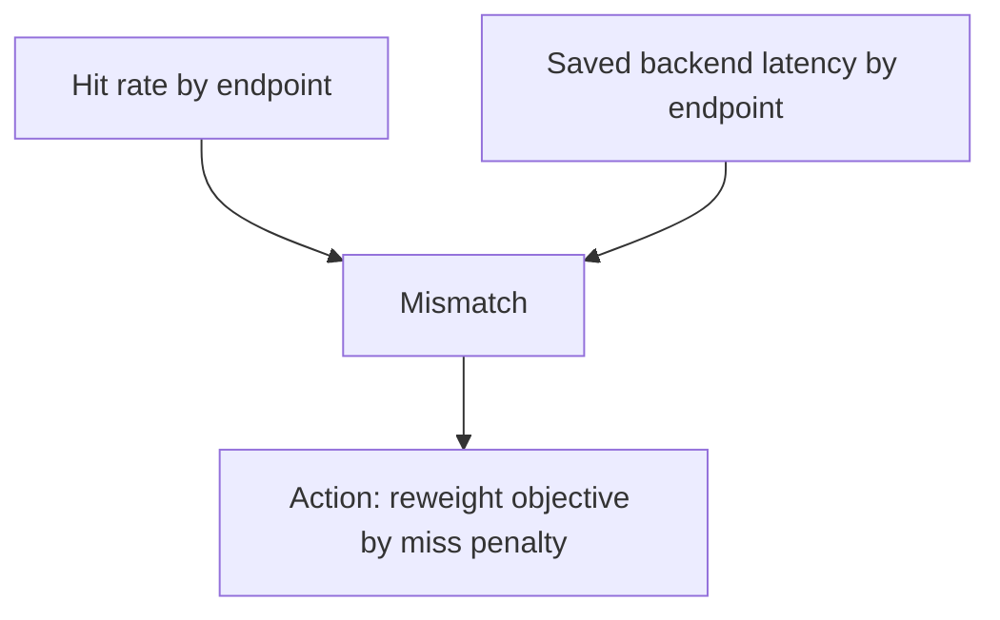
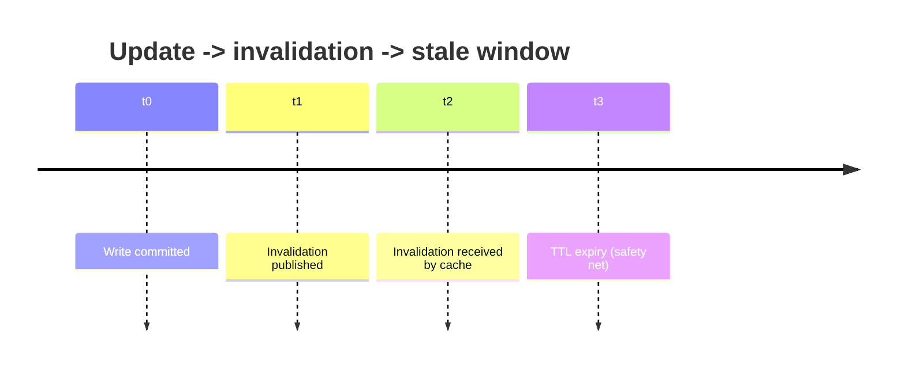

# Adaptive Caching with ML (in Distributed Systems)

[TARGET] Challenge: Your cache is "good"... until the traffic changes

It's Friday 11:58 AM. Your food delivery app is calm. At 12:00 PM, lunch hits and suddenly:

- Restaurant menus are requested 10x more.
- "Order status" endpoints become hot.
- A celebrity posts a promo code and a single city's traffic spikes.

Your distributed cache (Redis/Memcached/CDN edge) was tuned for the old pattern. TTLs are wrong. Eviction is wrong. Warm-up is wrong. The result is familiar:

- Cache hit rate drops.
- Tail latency climbs.
- Databases melt.
- Engineers scramble to "increase TTLs" and "add memory" and "pin hot keys."

Now the question:

> What if the cache could adapt-automatically-based on observed access patterns, cost, and risk?

That's adaptive caching with ML: using learned models (or learning-like methods) to tune caching decisions-what to store, where, for how long, with what priority-under changing workloads.

---

## [HANDSHAKE] What you'll build mentally in this article

You'll develop:

- A mental model of caching as an online decision system (not a static configuration).
- A map of ML approaches (from simple bandits to deep RL) and when each is appropriate.
- A distributed-systems lens: consistency, replication, failure, observability, and cost.
- Practical design patterns: feature pipelines, training loops, safe rollout, and fallback.

[IMAGE: High-level tiered caching + control plane]

```mermaid
flowchart LR
  C[Clients] --> E[Edge/CDN Cache]
  E --> R[Regional Shared Cache\n(Redis/Memcached)]
  R --> S[Service]
  S --> D[(Database/Origin)]

  subgraph ControlPlane[ML/Policy Control Plane]
    T[Telemetry\n(hits/misses/latency/size/update events)] --> F[Feature/Aggregation\n(stream + sketches)]
    F --> M[Policy Computation\n(bandit/regression/heuristics)]
    M --> P[Policy Distribution\n(versioned configs)]
  end

  E -. metrics .-> T
  R -. metrics .-> T
  S -. metrics .-> T

  P -. async push .-> E
  P -. async push .-> R
  P -. async push .-> S
```

**Network assumptions (explicit):** caches and control plane communicate over unreliable networks with variable latency; partitions and partial failures are expected; clocks are not perfectly synchronized.

---

# [FAUCET] Section 1 - Caching is a delivery service, not a storage box

[TARGET] Scenario

Imagine a coffee shop with a limited pastry display case (cache). The kitchen (database) can bake anything, but it's slower. The display case holds a subset of items to serve quickly.

The manager must decide:

- Which pastries to keep in the case.
- How many of each.
- When to rotate out stale items.

Now translate:

- Display case size -> cache capacity.
- Baking time -> backend latency.
- Pastry popularity changes with time -> workload drift.
- Stale pastries -> invalid/expired data.

Key point: caching is a **policy under constraints**.

## [PUZZLE] Pause and think

If you could only change one knob dynamically in a cache, which gives the biggest benefit under changing workloads?

A) Cache size

B) TTL

C) Eviction policy

D) Admission policy (what gets cached)

### Reveal (answer)

It depends, but **admission policy often dominates**. A cache that admits "expensive and likely-to-be-reused" objects can outperform a larger cache with naive admission. TTL and eviction matter too, but admission decides what enters the game.

[KEY INSIGHT]

Adaptive caching is mostly about learning which objects are worth caching under current conditions.

---

# [MAGNIFY] Section 2 - What "adaptive caching with ML" actually means

[TARGET] Scenario

Your service has:

- A CDN caching images and static assets.
- A regional Redis caching user profiles.
- An in-process cache caching feature flags.

Each tier has different constraints:

- CDN: huge scale, coarse invalidation, cheap reads, expensive misses (origin load).
- Redis: shared, memory-bound, network hop, supports TTL.
- In-process: fastest but inconsistent across nodes.

"ML caching" is not one thing. It's a family of techniques applied to decisions like:

1. Admission: should we cache this response?
2. Eviction: if full, what do we evict?
3. TTL selection: how long should it live?
4. Prefetching: what should we warm up?
5. Placement: which tier/region should store it?
6. Replication: should we replicate hot keys across shards/regions?
7. Compression/encoding: store compressed? which codec?

## [GAME] Decision game: Which statement is true?

1) "Adaptive caching with ML always requires deep reinforcement learning."

2) "Adaptive caching with ML can be as simple as a contextual bandit that tunes TTLs."

3) "ML caching is only useful for CDNs, not for service caches."

### Reveal

2 is true. Many production systems use bandits, regression, or heuristics with learned parameters. Deep RL exists in papers and some specialized deployments, but it's not a prerequisite.

[KEY INSIGHT]

Treat ML as a spectrum: from lightweight online learning to heavy offline training.

---

# [MAGNIFY] Section 3 - Mental model: caching as an online optimization problem

[TARGET] Scenario

You operate a distributed cache cluster. Every request is a choice:

- If hit: serve quickly.
- If miss: pay backend cost, then decide whether to insert.

You have a budget (memory) and objectives:

- Minimize latency (especially p99).
- Reduce backend load.
- Maintain freshness/correctness.
- Control cost (memory, network, CPU).

## [PUZZLE] Pause and think

What makes caching hard in distributed systems compared to a single-node cache?

Write down 3 reasons.

### Reveal (examples)

1) Coordination and consistency: invalidation across nodes/regions.
2) Skew and hotspots: a small set of keys can overload a shard.
3) Partial failures: network partitions, node restarts, stale replicas.
4) Observability: attributing misses to policy vs. failures.
5) Multi-tenancy: competing workloads, fairness.

## Mental model: "Value per byte per time"

For each candidate object o, imagine a score:

- Benefit: expected future hits * saved cost per hit.
- Cost: bytes * time stored + risk of staleness.

A simplified objective:

> Cache objects that maximize (expected saved cost) / (memory-time) subject to capacity.

In practice you can't compute this exactly; you estimate it from telemetry.

[IMAGE: Value boundary]

```mermaid
quadrantChart
  title Cache-worthiness boundary
  x-axis Low size --> High size
  y-axis Low predicted reuse --> High predicted reuse
  quadrant-1 Cache-worthy
  quadrant-2 Maybe (cost-aware)
  quadrant-3 Not worth caching
  quadrant-4 Rare (huge + hot)
  A: [0.2, 0.8]
  B: [0.7, 0.9]
  C: [0.8, 0.2]
  D: [0.3, 0.3]
```

[KEY INSIGHT]

ML helps estimate "future reuse" and "miss cost" under drift, turning caching into a data-driven policy.

---

# [SIREN] Section 4 - Common misconceptions (that break ML caching)

## [SIREN] Misconception 1: "Hit rate is the only metric"

High hit rate can be useless if you're caching cheap items and missing expensive ones.

- Caching 1M tiny cheap keys may inflate hit rate.
- Missing one expensive, slow DB query may dominate p99.

Better metrics:

- Saved backend QPS (weighted by backend cost)
- Saved latency (weighted by percentile impact)
- Byte hit rate (bytes served from cache)
- Cost-aware hit rate (hit rate weighted by miss penalty)

## [SIREN] Misconception 2: "A global policy is best"

In distributed systems, locality matters:

- A key might be hot in one region and cold elsewhere.
- A key might be hot on one shard due to tenant affinity.

Global ML models can underfit local patterns.

## [SIREN] Misconception 3: "ML will automatically handle invalidation"

ML can tune TTLs, but correctness often needs explicit mechanisms:

- write-through / write-around / write-back (with care)
- cache-aside with versioning/ETags
- invalidation events (pub/sub, CDC)
- lease-based caching

[KEY INSIGHT]

ML improves efficiency, but correctness still comes from distributed systems design.

---

# [HANDSHAKE] Section 5 - The distributed caching stack: where ML plugs in

[TARGET] Scenario

You have three tiers:

1. Client/edge (CDN, browser cache)
2. Service-side shared cache (Redis/Memcached)
3. In-process per-node cache (Caffeine/Guava)

Where can ML act?

## [PUZZLE] Matching exercise

Match the decision to the tier where it's most impactful.

Decisions:

A) Prefetch top-N trending items

B) Admission: cache only if predicted reuse probability > threshold

C) TTL tuning based on update frequency

D) Shard replication for hotspots

Tiers:

1) Edge/CDN

2) Shared distributed cache

3) In-process cache

### Reveal (one reasonable mapping)

- A -> 1
- B -> 2
- C -> 2 and 3
- D -> 2

[IMAGE: Tiered knobs]



[KEY INSIGHT]

Different tiers have different feedback loops and failure modes; ML policies must be tier-aware.

---

# [MAGNIFY] Section 6 - Telemetry: the fuel for adaptive caching

[TARGET] Scenario

You want to predict whether caching a response will pay off. What data do you need?

At minimum:

- Key identity (or key features)
- Request frequency and recency
- Object size
- Miss penalty (backend latency, CPU, DB cost)
- Update frequency / staleness risk
- Tenant/region/shard context

## [PUZZLE] Pause and think

Which is more dangerous to get wrong for ML caching?

A) Underestimating object size

B) Underestimating miss penalty

C) Underestimating staleness risk

### Reveal

Often C is most dangerous because it can cause correctness issues (serving stale/incorrect data). But B can destroy performance by caching the wrong things. In practice, treat correctness as a **hard constraint** and optimize performance within it.

## Distributed telemetry pitfalls (production)

- **Sampling bias:** you log misses more than hits; models trained on misses can mis-estimate reuse.
- **Clock skew:** recency features across nodes can be inconsistent; prefer monotonic counters/EWMA computed locally.
- **Cardinality explosions:** key-level labels can overwhelm metrics systems; aggregate by namespace/tenant/region and use sketches (Count-Min, HyperLogLog).
- **Partial visibility:** edge caches may not log at the same granularity.
- **Feedback attribution:** a miss may be due to eviction, TTL expiry, invalidation, node restart, or routing changes-log miss reason.

[IMAGE: Data pipeline]

```mermaid
flowchart LR
  N1[Cache nodes] --> K[Stream bus]
  K --> A[Aggregator\n(EWMA, sketches)]
  A --> FS[Feature store]
  FS --> OS[Online scorer\n(optional)]
  FS --> TR[Trainer]
  TR --> REG[Model registry\n(versioned)]
  REG --> PD[Policy distributor]
  PD --> N1
```

[KEY INSIGHT]

Adaptive caching is as much a telemetry + control-plane problem as an ML problem.

---

# [PUZZLE] Section 7 - Baselines before ML: what you must beat

[TARGET] Scenario

Your team proposes "ML caching." Your SRE asks: "What baseline are we beating?"

Common baselines:

- LRU / LFU / ARC / 2Q
- Static TTL
- Size-aware eviction (GreedyDual)
- Admission via TinyLFU (modern high-perf caches)

## [GAME] Decision game: Which baseline is hardest to beat in practice?

1) Plain LRU

2) Random eviction

3) TinyLFU + segmented LRU

### Reveal

3. Modern policies like TinyLFU already approximate frequency with low overhead. ML must justify complexity by outperforming these under drift, multi-objective constraints, or cost-awareness.

## Comparison table: classical vs adaptive

| Dimension | Classical cache policy | Adaptive/ML cache policy |
|---|---|---|
| Workload assumptions | Stationary-ish | Non-stationary, drifting |
| Objective | Hit rate | Cost-aware + latency + fairness |
| Inputs | Recency/frequency | Context (tenant/region), miss penalty, size, update rate |
| Control | Local, per-node | Often needs control plane + coordination |
| Risk | Low | Higher (bad model harms performance/correctness) |

[KEY INSIGHT]

The bar is high: ML must beat strong heuristics under real constraints.

---

# [FAUCET] Section 8 - Approach 1: Cost-aware admission with supervised learning

[TARGET] Scenario

You have a cache-aside pattern:

1. Request comes in.
2. Cache miss -> fetch from backend.
3. Decide whether to insert into cache.

Instead of caching everything, you want to cache only items with positive expected value.

## The learning problem

For each miss event, predict:

- Reuse probability within a horizon H (e.g., next 10 minutes)
- Or expected number of hits within H

Then compute expected value:

> EV = (expected hits * miss_penalty) - (storage_cost)

Cache if EV > 0.

### Production clarification: what is "storage_cost"?

In practice it's not just bytes:

- memory pressure -> higher eviction rate -> more misses elsewhere
- CPU for serialization/compression
- network cost (shared cache hop)

A common approximation is **value-per-byte** with a global pressure factor.

## Features you might use

- Key namespace (endpoint type)
- Tenant ID / plan tier
- Region
- Object size
- Backend latency on miss
- Time of day / day of week
- Recent request rate (EWMA)
- Recent uniqueness ratio (how many distinct keys)

## [PUZZLE] Exercise: label definition

You need labels for supervised learning.

Which label is better?

A) "Was this key requested again within 10 minutes?" (binary)

B) "How many times was this key requested again within 10 minutes?" (count)

### Reveal

B is richer but harder (zero-inflated counts, heavy tails). A is simpler and often good enough for admission thresholds. Many systems start with A and move to B when stable.

[CODE: Python - corrected label generation]

**Correction:** the original code scanned the deque per event (O(n^2) worst-case) and had a no-op `while ... break` loop. Below is a linear-time approach using per-key blocks and a moving pointer.

```python
from dataclasses import dataclass

@dataclass(frozen=True)
class Event:
    ts: float  # seconds since epoch
    key: str

def label_reuse(events: list[Event], horizon_s: int = 600) -> dict[tuple[float, str], tuple[int, int]]:
    """For each event (ts,key), compute:
    - reuse_within_horizon: 1 if key appears again within (ts, ts+horizon]
    - future_hit_count: number of future occurrences within that horizon

    Complexity: O(n log n) for sort + O(n) scan.
    """
    if horizon_s <= 0:
        raise ValueError("horizon_s must be positive")

    events = sorted(events, key=lambda e: (e.key, e.ts))
    labels: dict[tuple[float, str], tuple[int, int]] = {}

    i = 0
    while i < len(events):
        key = events[i].key
        j = i
        ts_list = []
        while j < len(events) and events[j].key == key:
            ts_list.append(events[j].ts)
            j += 1

        r = 0
        for l in range(len(ts_list)):
            if r < l + 1:
                r = l + 1
            while r < len(ts_list) and ts_list[r] <= ts_list[l] + horizon_s:
                r += 1
            cnt = (r - (l + 1))
            labels[(ts_list[l], key)] = (1 if cnt > 0 else 0, cnt)

        i = j

    return labels
```

## Distributed systems twist: horizon and locality

Reuse is not global:

- A key might be reused within a region but not across regions.
- A key might be reused on a single shard due to consistent hashing.

So you often train per-scope models:

- per region
- per tenant tier
- per key namespace

[KEY INSIGHT]

Supervised admission works when you can define a stable horizon and collect reliable reuse labels per scope.

---

# [MAGNIFY] Section 9 - Approach 2: Contextual bandits for TTL tuning

[TARGET] Scenario

Static TTL is a blunt instrument:

- Too short -> frequent misses, backend load.
- Too long -> stale data, correctness risk.

You want TTL that adapts per key type and context.

## Why bandits?

TTL tuning is an exploration vs exploitation problem:

- If you always choose the TTL you think is best, you might never discover better TTLs.
- If you explore too much, you harm performance.

A contextual bandit chooses an action (TTL bucket) given context, observes reward (hit improvement minus staleness penalty), and updates.

## [GAME] Decision game: bandit reward design

Which reward is safer?

1) Reward = hit_rate

2) Reward = saved_backend_latency - staleness_penalty - memory_penalty

### Reveal

2. Reward must reflect real objectives and include negative terms; otherwise the bandit will "cheat" by maximizing hit rate at the expense of correctness or memory.

## Practical TTL actions

Instead of continuous TTL, use buckets:

- 30s, 2m, 10m, 1h

This stabilizes learning and simplifies rollout.

[CODE: Python - LinUCB with production notes]

**Production note:** avoid per-request matrix inversion. Maintain `A_inv` incrementally (Sherman-Morrison) or update in batches.

```python
import numpy as np

class LinUCBBandit:
    def __init__(self, ttl_buckets_s: list[int], d: int, alpha: float = 1.0):
        if d <= 0:
            raise ValueError("d must be positive")
        if not ttl_buckets_s:
            raise ValueError("ttl_buckets_s must be non-empty")
        self.ttls = list(ttl_buckets_s)
        self.alpha = float(alpha)
        self.A = [np.eye(d) for _ in self.ttls]
        self.Ainv = [np.eye(d) for _ in self.ttls]
        self.b = [np.zeros((d, 1)) for _ in self.ttls]

    def choose(self, x: np.ndarray) -> int:
        x = np.asarray(x, dtype=float).reshape(-1, 1)
        scores = []
        for Ainv, b in zip(self.Ainv, self.b):
            theta = Ainv @ b
            mean = float(theta.T @ x)
            conf = float(self.alpha * np.sqrt(x.T @ Ainv @ x))
            scores.append(mean + conf)
        return int(np.argmax(scores))

    def update(self, arm: int, x: np.ndarray, reward: float) -> None:
        if not (0 <= arm < len(self.ttls)):
            raise IndexError("Invalid arm")
        x = np.asarray(x, dtype=float).reshape(-1, 1)
        self.A[arm] += x @ x.T
        Ainv = self.Ainv[arm]
        denom = 1.0 + float(x.T @ Ainv @ x)
        self.Ainv[arm] = Ainv - (Ainv @ x @ x.T @ Ainv) / denom
        self.b[arm] += float(reward) * x
```

## Distributed wrinkle: delayed and censored rewards

You may not observe staleness immediately:

- A cached value might become wrong only after an update.
- Some keys are never updated during the observation window.

Bandits must handle:

- delayed rewards
- missing feedback

Common mitigation:

- conservative priors / pessimistic initialization
- cap TTL for high-risk namespaces
- incorporate update streams (CDC) to measure staleness events

[KEY INSIGHT]

Bandits are production-friendly for tuning discrete knobs (TTL buckets) with controlled exploration.

---

# [FAUCET] Section 10 - Approach 3: Learned eviction (and why it's tricky)

[TARGET] Scenario

Eviction happens under pressure. Your cache is full; you must choose a victim.

Classic policies approximate "keep items likely to be reused." ML suggests learning a value function per item.

## Why learned eviction is hard

- You need per-item scoring at very high QPS.
- You need low latency and predictable CPU.
- You need to handle millions of items with limited metadata.

## Mental model: eviction as "who is least valuable right now?"

Value might be:

- predicted future hits
- miss penalty
- size
- staleness risk

## [PUZZLE] Pause and think

If you could store only one extra byte of metadata per cache entry, what would you store?

A) last_access_time

B) access_count

C) predicted_value_score

D) tenant_id

### Reveal

Often C (a compact score) is most directly useful-if you can compute it cheaply. But in multi-tenant systems, D can enable fairness. Real systems often store a few bytes: segmented recency + tiny frequency sketches.

## Pragmatic path: hybrid policies

Instead of fully learned eviction, many deployments do:

- TinyLFU admission + LRU eviction
- Learned admission + classical eviction

Because admission reduces pressure; eviction becomes less critical.

[IMAGE: Hybrid path]



[KEY INSIGHT]

Start with learned admission/TTL; learned eviction is higher complexity and risk.

---

# [MAGNIFY] Section 11 - Placement and replication: ML meets topology

[TARGET] Scenario

You run a multi-region service with a regional cache per region. Some keys are global (product catalog), some are local (delivery ETAs).

You must decide:

- Cache in region only?
- Replicate across regions?
- Push to edge?

## Real-world analogy: stocking warehouses

A retailer has:

- local stores (edge)
- regional warehouses (regional cache)
- central warehouse (origin)

Stocking globally reduces misses but increases shipping and spoilage risk.

## [PUZZLE] Think about it

What's the distributed systems cost of replicating hot keys across regions?

Write two costs.

### Reveal

- Consistency/invalidation cost: updates must propagate globally.
- Network egress + latency: replication traffic across WAN.
- Failure coupling: a global replication pipeline outage can cause stale data everywhere.

## ML placement idea

Predict per key:

- regional demand distribution
- update rate
- size

Then choose placement:

- replicate only if (global demand benefit) > (WAN + staleness risk cost)

[CODE: Python - placement decision]

```python
from dataclasses import dataclass

@dataclass(frozen=True)
class PlacementInput:
    key: str
    size_bytes: int
    update_rate_per_s: float
    demand_by_region_qps: dict[str, float]

def should_replicate(inp: PlacementInput, wan_cost_ms: float, staleness_budget_s: float) -> bool:
    if inp.size_bytes <= 0:
        raise ValueError("size_bytes must be positive")
    if wan_cost_ms < 0 or staleness_budget_s < 0:
        raise ValueError("wan_cost_ms and staleness_budget_s must be non-negative")

    if inp.size_bytes > 2_000_000 or inp.update_rate_per_s > 0.2:
        return False

    total_qps = sum(max(0.0, q) for q in inp.demand_by_region_qps.values())
    if total_qps < 1.0:
        return False

    active_regions = sum(1 for q in inp.demand_by_region_qps.values() if q >= 0.5)
    staleness_risk = inp.update_rate_per_s * staleness_budget_s
    benefit = active_regions * total_qps
    cost = (wan_cost_ms / 100.0) + (10.0 * staleness_risk) + (inp.size_bytes / 1e6)

    return benefit > cost
```

### CAP/consistency note (critical)

Cross-region replication forces you to choose trade-offs:

- Under a WAN partition, you can keep serving from local caches (AP-ish) but risk staleness.
- Or you can block/validate against a primary (CP-ish) and preserve correctness but increase latency/unavailability.

For authoritative data (inventory, balances), prefer CP at the source of truth and cache only derived or validated views.

[KEY INSIGHT]

Placement is a multi-objective optimization over topology; ML helps forecast demand but must respect consistency constraints.

---

# [SIREN] Section 12 - Failure scenarios: when adaptive caching goes wrong

[TARGET] Scenario

Your ML caching system is live. Suddenly:

- Feature pipeline lags by 30 minutes.
- One region loses connectivity to the model service.
- The model is trained on holiday traffic but deployed on normal weekday traffic.

What happens?

## Failure mode catalog

1. Stale features -> wrong TTL/admission decisions.
2. Model service outage -> caches block or degrade.
3. Feedback loop instability -> oscillations (thrash between TTLs).
4. Hotspot amplification -> learned policy over-caches a key, causing shard hotspot.
5. Poisoning / adversarial keys -> attackers force caching of large objects.
6. Cache stampede: synchronized expiry causes thundering herd to backend.

## [GAME] Decision game: safe fallback

If the model service is down, what's the safest behavior?

A) Fail requests

B) Cache everything with long TTL

C) Revert to baseline policy (e.g., TinyLFU + conservative TTL caps)

D) Disable caching entirely

### Reveal

Usually C. You want a deterministic, well-tested baseline. Disabling caching can overload backend; caching everything risks staleness and memory blowups.

## Distributed systems design: control plane vs data plane

- Data plane (cache nodes) must remain fast and reliable.
- Control plane (ML policy) can be slower and occasionally unavailable.

Rule:

> Data plane should not depend synchronously on ML.

Meaning:

- cache nodes should use last-known-good parameters
- model updates should be asynchronous
- policies should be versioned and rollable

[IMAGE: Control plane/data plane separation]



### Production guardrails (non-negotiable)

- Circuit breaker: if policy update rate spikes or metrics regress, freeze to last-known-good.
- TTL caps by namespace: hard max TTL for correctness-sensitive data.
- Single-flight / request coalescing: prevent stampedes on miss.
- Per-key rate limiting: protect backend from hot keys.

[KEY INSIGHT]

Adaptive caching must degrade gracefully; otherwise it becomes a new single point of failure.

---

# [HANDSHAKE] Section 13 - Trade-offs: accuracy, latency, and operational complexity

[TARGET] Scenario

Your ML team proposes a transformer model to predict reuse for each key. Your cache team says: "We can't afford 2 ms extra per request."

## The latency budget reality

Caches are on the critical path. Even microseconds matter at scale.

So ML inference must be:

- extremely cheap (often linear models)
- or amortized (batch scoring)
- or moved off-path (periodic policy computation)

## Comparison table: inference strategies

| Strategy | Where inference runs | Pros | Cons | Typical use |
|---|---|---|---|---|
| On-request scoring | cache node hot path | most responsive | adds latency/CPU; risk | small feature sets, linear models |
| Async scoring | sidecar / background | avoids hot path | less reactive | TTL tuning, prefetch lists |
| Offline scoring | batch job | cheap at runtime | slow adaptation | CDN pre-warm, catalog caching |

## [PUZZLE] Pause and think

Which is most appropriate for in-process caches inside a stateless microservice?

A) On-request scoring with a heavy model

B) Async scoring with periodic updates

C) Offline scoring only

### Reveal

Usually B (or a very lightweight A). In-process caches need minimal overhead; periodic updates and simple heuristics are common.

[KEY INSIGHT]

In distributed systems, operational simplicity and predictability often beat marginal accuracy gains.

---

# [FAUCET] Section 14 - Real-world patterns: what companies actually do

[TARGET] Scenario

You want "real-world usage," not just research.

Common industry patterns (generalized):

1. CDNs and edge caches
   - popularity forecasting
   - prefetching trending content
   - TTL tuning per content type

2. Large-scale web caches
   - TinyLFU-style admission
   - size-aware eviction
   - learned ranking signals for expensive pages

3. Feature stores / ML platforms
   - cache embeddings/features with cost-aware policies
   - per-tenant quotas and fairness

4. Databases and storage systems
   - learned buffer pool management (research + some specialized deployments)

## [SIREN] Common misconception

"Everyone uses deep RL for cache eviction."

In practice, teams:

- start with cost-aware admission and safe adaptive TTLs
- keep eviction mostly classical
- invest heavily in observability and safety

[KEY INSIGHT]

The highest ROI is often in cost-aware admission + safe adaptive TTLs, not exotic eviction.

---

# [MAGNIFY] Section 15 - Designing the control loop (closed-loop caching)

[TARGET] Scenario

Adaptive caching is a control system:

- observe
- decide
- act
- measure
- update

If you get the loop wrong, you get oscillations.

## The control loop components

1. Telemetry: hits/misses, latencies, sizes, update events
2. Feature computation: aggregates, sketches, context
3. Policy computation: model training or online learning
4. Policy distribution: push configs to caches
5. Enforcement: admission/TTL/placement decisions
6. Evaluation: A/B tests, guardrails

[IMAGE: Closed-loop control diagram]

```mermaid
flowchart LR
  Obs[Observe\n(metrics/events)] --> Feat[Compute features]
  Feat --> Decide[Compute policy]
  Decide --> Dist[Distribute policy]
  Dist --> Act[Enforce in caches]
  Act --> Eval[Evaluate + guardrails]
  Eval --> Obs
  Delay[(Time delay)] -.-> Decide
```

## [PUZZLE] Think about delay

If your policy updates every 30 minutes, what kinds of workload changes will it fail to handle?

### Reveal

- flash crowds (minutes)
- sudden regional failover
- breaking news events

Mitigation:

- multi-timescale control: fast heuristics + slow ML
- anomaly detection triggers for rapid fallback

[KEY INSIGHT]

Adaptive caching often needs multiple timescales: fast local reactions and slower global learning.

---

# [PUZZLE] Section 16 - Interactive lab: design an ML admission policy

[TARGET] Scenario

You run an API gateway caching responses for endpoints:

- `/catalog/item/{id}` (read-heavy, occasional updates)
- `/user/{id}/profile` (read-heavy, frequent updates)
- `/search?q=` (expensive backend, highly variable)

Cache capacity is tight.

## Step 1: choose your objective

Pick one primary objective:

A) Maximize hit rate

B) Minimize backend CPU

C) Minimize p99 latency

### Reveal

In many systems, C is the business-facing goal, but you'll often operationalize it as B plus latency guardrails.

## Step 2: define a value function

Propose a simple score:

> score = predicted_future_hits * miss_latency_ms / size_bytes

Then cache if score > threshold.

## Step 3: add correctness constraints

Rules:

- Never cache endpoints with user-private data at shared tiers unless properly scoped (per-user keying + auth binding).
- Cap TTL for frequently updated namespaces.

## Step 4: choose model type

Options:

1) Logistic regression for "reuse within H"
2) Gradient boosted trees
3) Deep model

### Reveal

Start with 1 or 2. They are easier to debug, faster to run, and robust. Deep models are rarely necessary early.

[CODE: Python - admission decision using a logistic model]

```python
import math
from dataclasses import dataclass

@dataclass(frozen=True)
class AdmissionContext:
    namespace: str
    size_bytes: int
    miss_latency_ms: float
    ewma_qps: float

def sigmoid(z: float) -> float:
    if z >= 0:
        ez = math.exp(-z)
        return 1.0 / (1.0 + ez)
    ez = math.exp(z)
    return ez / (1.0 + ez)

def should_admit(ctx: AdmissionContext, w: dict[str, float], threshold: float = 0.55) -> bool:
    if ctx.size_bytes <= 0 or ctx.miss_latency_ms < 0:
        raise ValueError("Invalid context")
    if ctx.namespace in {"/user/private"}:
        return False
    if ctx.size_bytes > 1_000_000:
        return False

    z = w.get("bias", 0.0)
    z += w.get("log_size", -0.2) * math.log1p(ctx.size_bytes)
    z += w.get("miss_ms", 0.01) * ctx.miss_latency_ms
    z += w.get("qps", 0.5) * math.log1p(max(0.0, ctx.ewma_qps))
    z += w.get(f"ns:{ctx.namespace}", 0.0)

    p_reuse = sigmoid(z)
    return p_reuse >= threshold
```

[KEY INSIGHT]

A good ML caching policy is: simple model + good features + strong guardrails.

---

# [SIREN] Section 17 - Observability and debugging: proving the model helps

[TARGET] Scenario

You deploy adaptive caching and hit rate goes up-but p99 latency also goes up. Why?

Possible reasons:

- You cached many small cheap items, crowding out expensive ones.
- You increased TTL and served stale data, triggering retries.
- You created hotspots in one shard.

## What to instrument

- Hit rate by namespace/tenant/region
- Miss penalty distribution (latency on miss)
- Cache occupancy by namespace
- Evictions per second
- Hot key detection (top-K)
- Staleness incidents (version mismatch, invalidation lag)
- Miss reason (cold start, TTL expiry, eviction, invalidation, node restart)

## [PUZZLE] Debug exercise

You see:

- Hit rate +8%
- Backend QPS -2%
- p99 latency +20%

Which hypothesis is most likely?

A) You cached cheap endpoints

B) You reduced cache size

C) Your model is too accurate

### Reveal

A. Hit rate increased but backend barely changed; you're not saving expensive misses. You need cost-aware objectives.

[IMAGE: Dashboard mock]



[KEY INSIGHT]

Always evaluate caching by saved cost, not raw hit rate.

---

# [HANDSHAKE] Section 18 - Multi-tenancy and fairness: caches are shared resources

[TARGET] Scenario

A single large tenant floods your cache with hot keys, evicting smaller tenants' data. Your ML policy might "correctly" cache what's hot-but it's unfair.

## Fair caching goals

- Per-tenant quotas
- Weighted fairness (paid tiers)
- Isolation for noisy neighbors

## [PUZZLE] Pause and think

How can ML make fairness worse?

### Reveal

If the model optimizes global saved latency, it will prioritize tenants with higher volume, starving others. The model needs fairness constraints or per-tenant budgets.

## Design pattern: constrained optimization

- Reserve cache slices per tenant tier
- Run separate policies per slice
- Or add penalty terms for tenant dominance

[CODE: Python - fairness-aware admission]

```python
from dataclasses import dataclass

@dataclass(frozen=True)
class TenantState:
    tenant_id: str
    bytes_used: int
    quota_bytes: int

def fairness_penalty(state: TenantState) -> float:
    if state.quota_bytes <= 0:
        raise ValueError("quota_bytes must be positive")
    ratio = state.bytes_used / state.quota_bytes
    return 0.0 if ratio <= 1.0 else (ratio - 1.0) ** 2

def admit_with_fairness(base_score: float, state: TenantState, penalty_weight: float = 2.0) -> bool:
    if penalty_weight < 0:
        raise ValueError("penalty_weight must be non-negative")
    score = base_score - penalty_weight * fairness_penalty(state)
    return score > 0.0
```

[KEY INSIGHT]

In multi-tenant distributed systems, caching is resource allocation; ML must encode fairness explicitly.

---

# [MAGNIFY] Section 19 - Consistency and invalidation: ML-friendly correctness patterns

[TARGET] Scenario

Your cache stores user profiles. Users update their address; stale cached data is unacceptable.

## Caching patterns and correctness

- Cache-aside: app reads cache; on miss reads DB; writes cache.
  - Simple, but invalidation is hard.
- Write-through: writes go through cache.
  - Better consistency, higher write latency.
- Write-back: cache buffers writes.
  - Complex; risk on failure.
- Versioned entries: include version/etag; validate on read.
- Leases: cache holds lease; backend updates revoke.

### Consistency model clarity

Most caches provide eventual consistency for reads unless you add validation/versioning. Under partitions, you must choose:

- serve stale (availability) vs
- block/validate (consistency)

This is the CAP trade-off in practice.

## [GAME] Decision game: ML and TTL

True or false:

> "If we have perfect invalidation events, TTL doesn't matter."

### Reveal

Mostly false. TTL still matters as a safety net (missed invalidations, partitions) and for memory control. Perfect invalidation is rare; TTL caps limit blast radius.

[IMAGE: Staleness window]



[KEY INSIGHT]

Correctness comes from invalidation/versioning; ML tunes performance within safe staleness bounds.

---

# [FAUCET] Section 20 - Security and abuse: adversarial caching

[TARGET] Scenario

An attacker discovers your cache admits objects based on predicted reuse. They generate traffic that makes large objects appear reusable, causing cache pollution.

## Threats

- Cache pollution
- Hot key amplification
- Model exploitation (gaming features)

## Mitigations

- Per-tenant rate limits
- Admission caps for large objects
- Robust features (don't trust client-supplied)
- Anomaly detection

## [PUZZLE] Pause and think

Which is a strong mitigation with low complexity?

A) Train a bigger model

B) Cap object size for caching per namespace

C) Use deep RL

### Reveal

B. Simple guardrails beat complex models for abuse resistance.

[KEY INSIGHT]

Guardrails are part of the caching policy; ML should operate inside them.

---

# [PUZZLE] Section 21 - Progressive design: from heuristic to ML to safe autonomy

[TARGET] Scenario

You want to adopt adaptive caching without risking outages.

## Maturity ladder

1. Instrument: measure miss penalty, staleness, occupancy.
2. Cost-aware dashboards: saved latency/QPS.
3. Heuristic admission: cache only if miss_latency > X and size < Y.
4. Supervised admission: predict reuse; threshold.
5. Bandit TTL tuning: safe exploration.
6. Placement optimization: per-region forecasting.
7. (Maybe) learned eviction: only if necessary.

## [GAME] Decision game: rollout strategy

Which rollout is safest?

1) Turn on ML globally at once

2) Shadow mode: compute decisions but don't enforce; compare counters

3) Enable ML only during peak hours

### Reveal

2. Shadow mode lets you validate without impact. Then canary by region/tenant.

[CODE: JavaScript - shadow admission (with correctness + failure handling)]

```javascript
export async function handleRequest(req, res, deps) {
  const key = req.url;

  let cached = null;
  try {
    cached = await deps.cacheGet(key);
  } catch (_) {
    cached = null;
  }
  if (cached) return res.end(cached);

  const { body, missMs, sizeBytes, namespace } = await deps.backendFetch(key);

  const baselineAdmit = sizeBytes < 1_000_000 && missMs > 50;

  const shadow = await deps.modelScore({ key, missMs, sizeBytes, namespace })
    .then(p => ({ p, admit: p >= 0.55, err: null }))
    .catch(err => ({ p: null, admit: baselineAdmit, err: String(err) }));

  deps.metrics.count("admission.shadow", 1, {
    baseline: String(baselineAdmit),
    model: String(shadow.admit),
    model_err: String(!!shadow.err)
  });

  if (baselineAdmit) {
    try {
      await deps.cacheSet(key, body, { ttlSeconds: 120 });
    } catch (_) {}
  }

  res.end(body);
}
```

[KEY INSIGHT]

Treat ML caching like any control-plane change: shadow -> canary -> gradual rollout with guardrails.

---

# [WAVE] Section 22 - Final synthesis challenge: design your own adaptive cache

[TARGET] Synthesis scenario

You run a globally distributed "event ticketing" platform.

Workload characteristics:

- Ticket availability updates frequently near launch.
- Browsing traffic is read-heavy.
- Flash crowds occur when popular events drop.
- Multi-region active-active.
- Strict correctness for inventory counts.

You have:

- Edge CDN
- Regional Redis
- Service in-process caches

## [PUZZLE] Challenge questions (progressive reveal)

### 1) What do you cache at the edge?

Reveal (example)

Cache static assets, event pages that are safe to be slightly stale, and search suggestions; avoid inventory counts.

### 2) Which ML knob do you implement first?

A) Learned eviction in Redis

B) Cost-aware admission for expensive browse endpoints

C) Global replication of all hot keys

Reveal

B.

### 3) How do you ensure correctness for inventory?

Reveal

Use strong consistency at the source of truth; cache only derived, non-authoritative views with versioning/ETags; short TTL caps; invalidate on updates.

### 4) What failure mode worries you most?

- Model service outage
- Feature pipeline lag
- Regional partition

Reveal (example)

Model outage: caches revert to baseline admission + conservative TTL caps; control plane uses last-known-good config; alert on drift.

---

[KEY INSIGHT] (final)

Adaptive caching with ML is a distributed control system: ML forecasts value, distributed systems enforce correctness, and operations ensures safety under failure.

---

## Extra challenge (for the ambitious)

Design a two-timescale policy:

- Fast local heuristic responds within seconds (hot key detection, TTL caps, single-flight).
- Slow global learner updates every 10 minutes (admission thresholds per namespace/region).

Questions:

1) What telemetry feeds each loop?
2) How do you prevent oscillations?
3) What guardrails are non-negotiable?

[IMAGE: Two-timescale control loop]

```mermaid
flowchart TB
  subgraph Fast[Fast local loop (seconds)]
    L1[Local hot-key detector]
    L2[Single-flight / coalescing]
    L3[TTL caps + rate limits]
  end

  subgraph Slow[Slow global loop (minutes)]
    G1[Aggregated telemetry]
    G2[Train/fit policy]
    G3[Push versioned thresholds]
  end

  Fast -->|stabilizes| Cache[Cache nodes]
  Cache -->|metrics| G1
  Slow -->|async policy| Cache
```
