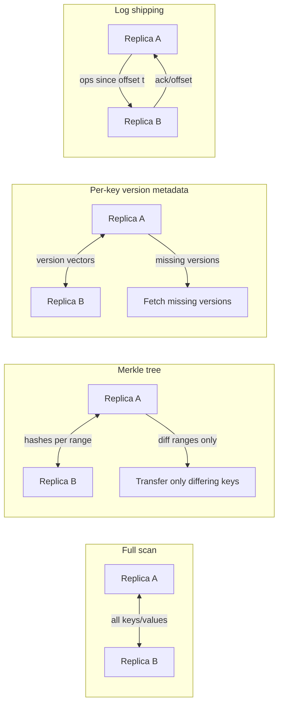
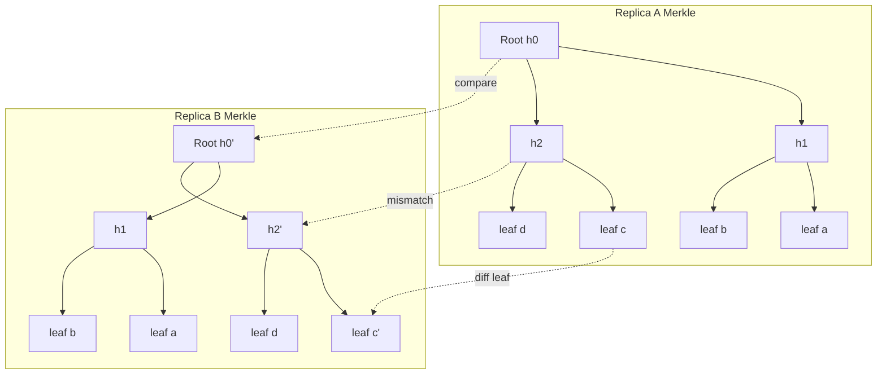
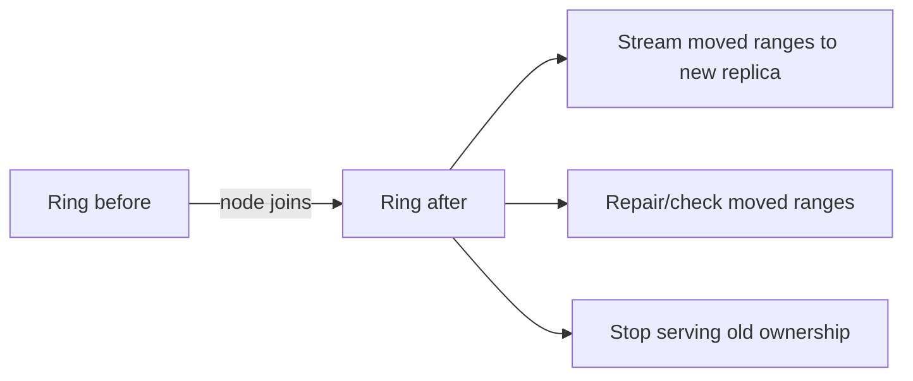

# Anti-Entropy and Read Repair (Final)


---

## Challenge: Your database is "eventually consistent"... until it isn't

You run a globally distributed key-value store with **5 replicas per key**. Writes are fast and available even during partitions. You accept **eventual consistency**.

It's Friday night. A customer updates their delivery address. Minutes later, your support dashboard shows the old address, while the mobile app shows the new one. Two hours later, a warehouse prints labels using the old address.

You check the cluster: no single node is "down." Network partitions came and went. Some replicas missed updates. Now you have **divergent replicas**.

**Your challenge:** How do you make replicas converge again--*without* turning every write into a global transaction?

### Pause and think
- If you do nothing, will replicas converge on their own?
- If yes, *why*?
- If no, what mechanism forces convergence?

### Key Insight
> Eventual consistency is not a property you get for free from "async replication." You need explicit **anti-entropy** mechanisms (and/or equivalent catch-up mechanisms) to repair divergence.

---

## Mental model: The coffee shop receipt problem

Imagine a chain of coffee shops (replicas). Customers place orders (writes). Each shop keeps a local notebook of orders.

Sometimes:
- A shop's internet goes out (partition).
- A shop's barista is overwhelmed and misses a message (loss / timeout).
- A shop restarts and loses some recent notes (crash + non-durable state).

Now the notebooks differ.

To fix this, the chain can:
1. **Compare notebooks periodically** and reconcile differences (anti-entropy).
2. **Fix inconsistencies when a customer asks about an order** (read repair).

Anti-entropy is like corporate auditing; read repair is like "customer service fixes it when someone calls."

### Key Insight
> Anti-entropy and read repair are complementary: one is *background convergence*, the other is *on-demand convergence triggered by reads*.

---

## What are we repairing, exactly?

Replica divergence happens because in distributed systems:
- Messages are delayed, dropped, or reordered.
- Nodes fail and recover.
- Partitions isolate subsets of replicas.
- Writes are accepted by quorums smaller than the full replica set.

When you do **partial writes** (e.g., write to 2 of 3 replicas), you create **stale replicas**.

### Decision game: Which statement is true?

Pick one (pause and think):

A) If you use quorum reads and quorum writes, you never need repair.

B) Repair is only needed after node failures.

C) Repair is needed whenever replicas can miss updates, even if the system stays available.

D) Repair is unnecessary if you use CRDTs.

### Reveal
**Correct: C.**

- **A is false:** Quorums reduce inconsistency exposure but do not guarantee every replica gets every update.
- **B is false:** Partitions, overload, timeouts, and hinted handoff can leave replicas stale even without "hard failures."
- **D is misleading:** CRDTs simplify conflict resolution, but you still need **state dissemination** (anti-entropy, gossip, log shipping, etc.) to converge.

### Key Insight
> Repair is about *propagation and convergence*, not just "fixing broken disks."

---

## Common Misconception: "Eventual consistency means it will eventually be consistent automatically"

**Misconception:** If you wait long enough, replicas converge.

**Reality:** Without explicit repair/catch-up, divergence can persist indefinitely.

Why?
- If a replica missed an update and no future operation touches that key, nothing forces it to learn.
- If you only replicate on writes, a permanently stale node stays stale.

### Key Insight
> "Eventually" requires a mechanism that keeps trying until convergence happens.

---

## Two families of repair

There are two classic approaches:

1. **Anti-Entropy** (background): replicas exchange summaries and reconcile differences.
2. **Read Repair** (foreground-ish): reads detect divergence and repair replicas as a side-effect.

They often coexist (e.g., Dynamo-style systems, Cassandra).

### Pause and think
If you had to pick only one, which would you choose for:
- A cold key that's rarely read?
- A hot key that's read constantly?

---

## Anti-Entropy: The "auditor" that makes replicas converge

Anti-entropy is a protocol where replicas periodically compare their data and repair missing or divergent updates.

### Real-world parallel (delivery service)
Think of two warehouses (replicas) that both fulfill orders. Every night, they:
- Compare inventory counts.
- Identify mismatches.
- Transfer stock or reconcile logs.

This nightly reconciliation is anti-entropy.

### Why anti-entropy exists
- Repairs **silent loss** (missed writes).
- Repairs **long-lived partitions** after healing.
- Bounds inconsistency windows.
- Improves durability when some replicas were temporarily unavailable.

### Key Insight
> Anti-entropy is the "eventual" in eventual consistency.

---

## Anti-Entropy mechanisms: from naive to scalable

### 1) Full data comparison (naive)
Two replicas compare all keys/values.

- Simple
- O(dataset size) bandwidth and CPU
- Doesn't scale

### 2) Merkle trees (Dynamo-style)
Replicas compare hashes over ranges of keys.

- Efficient: only transfer differing ranges
- Works well for large datasets
- Trade-off: tree maintenance, range partitioning

### 3) Version vectors / per-key metadata exchange
Replicas exchange causal metadata to determine what's missing.

- Precise for per-key reconciliation
- Trade-off: metadata overhead can be large

### 4) Log-based anti-entropy (CDC-like)
Replicas exchange operation logs (or digests of logs).

- Efficient if logs are retained
- Natural with append-only storage
- Trade-off: requires log retention and compaction strategy

### Visual


### Key Insight
> Anti-entropy is fundamentally about **finding differences cheaply**.

---

## Matching exercise: Mechanism -> Best fit

Match each anti-entropy mechanism to the scenario (pause and think):

1) Full data comparison
2) Merkle trees
3) Version-vector exchange
4) Log-based anti-entropy

Scenarios:

A) Very small dataset (few MB), extreme simplicity desired.

B) Large keyspace, range-partitioned storage, want to avoid scanning everything.

C) Need to reconcile concurrent updates with causality tracking per key.

D) Append-only event store with strong log retention; want fast catch-up.

### Reveal
1->A, 2->B, 3->C, 4->D

### Key Insight
> The "best" anti-entropy strategy depends on your data model, metadata budget, and storage layout.

---

## Deep dive: Merkle-tree anti-entropy (Dynamo/Cassandra lineage)

Merkle trees let two replicas determine which parts of their key ranges differ without exchanging all values.

### Mental model: Restaurant menu checksum
Two restaurants claim they serve the same menu. Instead of reading every item aloud, they:
- Hash sections of the menu.
- If a section hash differs, they zoom in.
- Eventually they find the exact items that differ.

That zoom-in is the tree traversal.

### How it works
1. Partition the keyspace into ranges (often aligned with consistent hashing tokens).
2. Build a Merkle tree per range:
   - Leaves represent subsets of keys (or fixed-size buckets).
   - Internal nodes are hashes of child hashes.
3. When two replicas compare:
   - If root hashes match -> range is consistent.
   - If not -> recursively compare children until you find differing leaves.
4. Transfer the missing keys/versions for those leaves.

### Visual


### Trade-offs
- Pros: bandwidth efficient; avoids full scans.
- Cons:
  - Tree maintenance overhead.
  - Harder with frequent updates unless trees are incrementally maintained.
  - Range splits/merges require recomputation.

### Production insight
Merkle trees are most effective when:
- key ranges are stable,
- you can amortize tree rebuilds,
- and you have a clear "range ownership" model.

If your system already has an ordered log (LSM commitlog, Raft log, CDC stream), **log-based catch-up** is often simpler and cheaper than maintaining Merkle trees.

### Key Insight
> Merkle trees turn "compare everything" into "compare hashes, then zoom in."

---

## Common Misconception: "Merkle trees prevent conflicts"

Merkle trees only help you discover *differences*. They don't decide *which version wins*.

Conflict resolution still depends on:
- last-write-wins (LWW)
- vector clocks/version vectors
- CRDT merge functions
- application-level reconciliation

### Key Insight
> Anti-entropy finds divergence; your **data model** decides how to merge it.

---

## Read Repair: Fix it when someone asks

Read repair repairs inconsistencies during reads.

### Scenario
Client reads key `user:123`.
- Replica A returns version `v5`
- Replica B returns version `v3`
- Replica C returns version `v5`

The coordinator detects B is stale and writes `v5` back to B.

### Real-world parallel (customer calling a restaurant)
A customer calls: "What's my reservation time?"
- One host says 7pm.
- Another says 6pm.

They reconcile *because the customer asked*. That's read repair.

### Key Insight
> Read repair is opportunistic anti-entropy triggered by read traffic.

---

## Read repair in quorum systems

Many Dynamo-inspired systems use:
- `N`: replication factor
- `R`: read quorum size
- `W`: write quorum size

If `R + W > N`, reads and writes overlap (at least one replica saw the write), improving freshness.

But even with quorum overlap:
- Some replicas may still be stale.
- Read repair helps bring *all* replicas up to date.

### Think about it
If `N=3, W=2, R=2`:
- A write hits replicas A and B.
- Replica C misses it.

A read from B and C returns `new` from B and `old` from C. Coordinator repairs C.

### CAP/consistency clarification
- During a partition, if you keep accepting writes (AP posture), you must tolerate divergence.
- Quorums (`R+W>N`) reduce stale reads **when the network is healthy enough to reach quorums**.
- Under partition, you may not be able to reach `R` or `W`; systems often fall back to smaller quorums (increasing staleness risk) or fail the operation (favoring consistency).

### Key Insight
> Quorums reduce the chance of stale reads; read repair reduces the *duration* of staleness across replicas.

---

## Decision game: Read repair timing

Which statement is true? (pause and think)

A) Read repair must be synchronous (client waits).

B) Read repair must be asynchronous (client never waits).

C) Read repair can be synchronous or asynchronous depending on latency vs convergence goals.

D) Read repair is only safe with LWW.

### Reveal
**Correct: C.**

- Synchronous read repair: client waits until stale replicas are updated (stronger convergence, higher latency).
- Asynchronous read repair: client gets response quickly, repairs happen in background (lower latency, slower convergence).

And D is false: read repair works with any merge strategy, as long as you can determine what update to propagate.

### Production insight
Many systems implement **bounded** synchronous repair, e.g.:
- wait for the read quorum response,
- fire-and-forget repairs to non-quorum replicas,
- or wait for at most `X ms` of repair before returning.

### Key Insight
> Read repair is a policy choice: *pay latency now* or *pay inconsistency later*.

---

## Mental model: "Two-phase" customer service

Read repair often behaves like:
1. Gather phase: ask multiple replicas for their versions.
2. Fix phase: push the winning/merged version to stale replicas.

This resembles a mini "repair transaction," but scoped to a single key and usually without global locking.

### Key Insight
> Read repair is localized, best-effort reconciliation--not distributed transactions.

---

## Failure scenarios: where repairs get tricky

### 1) Network partition during repair
You read from A and B, detect C is stale, but C is unreachable.

What happens?
- You may record a hint (hinted handoff) to replay later.
- Or you skip repair and rely on anti-entropy later.

**Production note:** if you queue hints, you need:
- bounded hint storage,
- backpressure,
- and a policy for dropping/compacting hints (otherwise hints become an unbounded log).

### 2) Replica returns corrupted or partial data
If a replica has bit rot or corrupted SSTable:
- Merkle trees detect mismatch.
- Repair may copy correct data from peers.

But beware: if corruption affects hashes too, detection may fail unless you have:
- per-block checksums,
- end-to-end checks (e.g., value checksum stored with the value),
- periodic scrubbing.

### 3) Concurrent writes during repair
While you repair, a new write arrives.

You must avoid overwriting newer data with older data.

This requires:
- version comparison (timestamps, vector clocks, HLC)
- conditional writes ("only write if my version is newer / not dominated")

### 4) Byzantine-like behavior (rare but relevant)
If a replica lies or is compromised, anti-entropy/read repair can spread bad data.

Mitigations:
- authenticated digests
- end-to-end signatures
- majority voting

### Key Insight
> Repair is itself a distributed protocol and inherits the same failure modes as replication.

---

## Common Misconception: "Read repair guarantees monotonic reads"

Read repair helps convergence, but it doesn't guarantee that a client won't see older data later unless you also provide:
- session guarantees (read-your-writes)
- sticky sessions
- client-side version tracking

### Key Insight
> Read repair is about replica state, not client-perceived consistency guarantees.

---

## Progressive reveal: A concrete timeline

### Step 0: Setup
- `N=3` replicas: A, B, C
- Write quorum `W=2`
- Read quorum `R=2`

### Step 1: Write happens
Client writes `x=1`.
- A stores `x=1`
- B stores `x=1`
- C misses it (partition)

Question: Is the system "consistent"? Pause and think.

### Reveal
It's *internally divergent*. But many clients will still read `x=1` because reads overlap with A or B.

### Step 2: Partition heals
C is back.

Question: Does C automatically learn `x=1`? Pause.

### Reveal
Not unless:
- a future write reaches C,
- a read repair touches `x`,
- hinted handoff delivers the missed write,
- or anti-entropy runs.

### Step 3: A read occurs
Client reads `x` from B and C.
- B returns `x=1`
- C returns `x=0` (old)

Coordinator returns `x=1` and repairs C.

Question: Should the client wait for repair? Pause.

### Reveal
Depends:
- If you need stronger convergence quickly, sync repair.
- If you prioritize latency, async repair.

### Key Insight
> Read repair turns read traffic into a convergence force.

---

## Trade-off table: Anti-entropy vs Read repair

| Dimension | Anti-Entropy (Background) | Read Repair (On-read) |
|---|---|---|
| Trigger | Timer / scheduling / gossip | Client reads |
| Coverage | Whole dataset over time | Only keys that are read |
| Convergence for cold keys | Good | Poor |
| Latency impact | Usually none for reads/writes | Can increase read latency if synchronous |
| Bandwidth pattern | Predictable, can be throttled | Burstier; follows read hotspots |
| Operational control | High (tune rate, windows) | Medium (depends on workload) |
| Failure sensitivity | Needs careful scheduling; may lag | Needs multi-replica reads; may skip unreachable replicas |

### Key Insight
> Anti-entropy is your safety net; read repair is your fast-path for hot data.

---

## Choosing a repair strategy under workload skew

Your workload follows a Zipf distribution:
- 1% of keys get 90% of reads
- 99% of keys are "cold"

### Pause and think
If you rely only on read repair:
- What happens to cold keys after a partition?

### Reveal
Cold keys may remain inconsistent for a very long time--possibly forever.

### Key Insight
> Read repair alone is insufficient when the keyspace has cold regions.

---

## Anti-entropy scheduling: How often is "often enough"?

Anti-entropy frequency trades off:
- Convergence time (staleness window)
- Bandwidth and CPU
- Interference with foreground traffic

### Mental model: Cleaning staff in a restaurant
If you clean tables constantly:
- restaurant stays spotless
- staff may interrupt diners

If you clean once per night:
- less interference
- mess accumulates during the day

### Practical knobs
- Repair interval (per range)
- Max bandwidth per node
- Concurrency (how many ranges repaired in parallel)
- Prioritization (hot partitions first? recently unstable nodes?)

### Production insight
Plan for **post-partition catch-up**:
- after a network event, divergence spikes;
- if every node starts repairing aggressively, you get a repair storm.

Use:
- global rate limits,
- jittered schedules,
- and per-datacenter bandwidth caps.

### Key Insight
> Anti-entropy is a *capacity planning* problem disguised as a correctness feature.

---

## Exercise: Estimate repair bandwidth

Assume:
- Dataset per node: 2 TB
- Average churn per day: 2% keys updated
- Anti-entropy runs continuously and wants to keep divergence under 6 hours

Pause and think: Roughly how much data must be exchanged per node per 6 hours to keep up?

### Reveal (back-of-the-envelope)
2% per day ~= 0.083% per hour.
In 6 hours: ~= 0.5% of dataset changes.
0.5% of 2 TB = 10 GB of changed data.

So you need capacity for ~10 GB/6 hours ~= 0.46 MB/s of *net changed payload*--plus overhead (hashes, retransmits, metadata, amplification).

### Key Insight
> Repair cost is dominated by *churn* and *amplification*, not total dataset size--if your diffing is efficient.

---

## Read repair policies: probabilistic and adaptive approaches

Some systems don't repair on every read. They do:
- probabilistic read repair: repair with probability `p`
- adaptive read repair: increase repair rate when divergence is suspected

Why?
- Repair writes can be expensive.
- A hot key could cause excessive write amplification if repaired on every read.

### Decision game: What's the risk of probabilistic read repair?

A) It can permanently prevent convergence.

B) It can slow convergence for hot keys but still converge for cold keys.

C) It can slow convergence, and cold keys may never converge without anti-entropy.

D) It makes reads strongly consistent.

### Reveal
**Correct: C.**

Probabilistic read repair reduces load but increases the expected time to convergence--and does nothing for cold keys unless anti-entropy exists.

### Key Insight
> Probabilistic read repair is a *load-shedding* tool, not a correctness guarantee.

---

## Conflict resolution during repair

Repair requires deciding what to propagate.

### Common strategies
1. **Last-Write-Wins (LWW)**
   - Compare timestamps (physical or hybrid logical clocks).
   - Risk: clock skew can cause lost updates.

2. **Version vectors / vector clocks**
   - Track causality.
   - Detect concurrency.
   - Merge requires application logic or multi-value storage.

3. **CRDTs**
   - Merge is deterministic and associative/commutative.
   - Still needs dissemination (anti-entropy) to converge.

### Mental model: Two chefs editing a recipe
- LWW: "Who edited last wins." Easy, sometimes wrong.
- Vector clocks: "We can tell if edits were independent." More metadata.
- CRDT: "Edits can be merged mechanically." Requires special data types.

### Key Insight
> Repair is not just copying bytes; it is enforcing your system's **merge semantics**.

---

## [CODE: Python, simulate vector-clock-based read repair]

**Fixes vs draft:**
- The replica store is now keyed by **(key, replicaId)**, not just replicaId.
- Reads now fetch the specific key from each replica.
- Repair writes are conditional and do not blindly overwrite concurrent siblings.

```python
from __future__ import annotations

from dataclasses import dataclass
from typing import Dict, List, Tuple

VClock = Dict[str, int]


@dataclass(frozen=True)
class Version:
    value: str
    vclock: VClock


def dominates(a: VClock, b: VClock) -> bool:
    """Return True if vclock a causally dominates b."""
    keys = set(a) | set(b)
    ge = all(a.get(k, 0) >= b.get(k, 0) for k in keys)
    gt = any(a.get(k, 0) > b.get(k, 0) for k in keys)
    return ge and gt


def merge_siblings(versions: List[Version]) -> List[Version]:
    """Keep only non-dominated versions (siblings remain on concurrency)."""
    out: List[Version] = []
    for v in versions:
        if any(dominates(o.vclock, v.vclock) for o in versions if o is not v):
            continue
        if any(v.vclock == o.vclock and v.value == o.value for o in out):
            continue
        out.append(v)
    return out


# Store model: store[key][replica_id] = list of versions
Store = Dict[str, Dict[str, List[Version]]]


def quorum_read_and_repair(
    store: Store,
    key: str,
    quorum: List[str],
    repair_targets: List[str] | None = None,
) -> Tuple[List[Version], Store]:
    """Quorum read + best-effort repair.

    - Reads from `quorum` replicas.
    - Merges siblings.
    - Repairs `repair_targets` (defaults to quorum replicas) if they are missing merged versions
      or only have dominated versions.

    Simplified model: real systems also handle timeouts, partial responses,
    hinted handoff, and background retries.
    """
    per_replica = store.get(key, {})

    # Gather
    read_versions: List[Version] = []
    for rid in quorum:
        read_versions.extend(per_replica.get(rid, []))

    if not read_versions:
        raise KeyError(f"key={key} not found on quorum={quorum}")

    merged = merge_siblings(read_versions)

    # Repair
    targets = repair_targets if repair_targets is not None else quorum
    for rid in targets:
        current = per_replica.get(rid, [])

        # If current has any version that is not dominated by merged, keep it (avoid clobbering).
        # Otherwise, write merged.
        safe_to_overwrite = True
        for c in current:
            if not any(dominates(m.vclock, c.vclock) for m in merged):
                safe_to_overwrite = False
                break

        if not current or safe_to_overwrite:
            per_replica[rid] = merged

    store[key] = per_replica
    return merged, store


if __name__ == "__main__":
    # Simulate partitioned concurrent writes:
    # - A/B have "new" from A
    # - C has "old" written concurrently on C
    store: Store = {
        "user:123": {
            "A": [Version("new", {"A": 1})],
            "B": [Version("new", {"A": 1})],
            "C": [Version("old", {"C": 1})],
        }
    }

    merged, store = quorum_read_and_repair(
        store,
        key="user:123",
        quorum=["B", "C"],
        repair_targets=["C"],
    )
    print("merged:", merged)
    print("after repair:", store["user:123"])
```

---

## Read repair and tombstones (deletes)

Deletes are tricky in eventually consistent stores.

If you delete key `k` on A and B, but C missed it:
- C might later "resurrect" the value during repair if you don't propagate tombstones.

### Mental model: "Out of stock" sign
A tombstone is like an "out of stock" sign posted at the shelf.
If one store doesn't get the sign, it might keep selling the old item.

### Practical implications
- Tombstones must be replicated and repaired like normal writes.
- Tombstone GC must wait longer than the maximum divergence window, or you risk resurrection.

### Production insight
Define and enforce a **deletion safety window**:
- `tombstone_gc_grace >= max(partition_duration) + max(repair_lag) + clock_skew_budget`

If you can't bound those, you must treat deletes as **permanent** (no GC) or use a different semantic model (e.g., CRDT sets with causal context).

### Key Insight
> Repair must treat deletes as first-class updates, or your system will resurrect data.

---

## Common Misconception: "Compaction removes the need for repair"

Compaction reorganizes on-disk structures (e.g., SSTables) and may drop obsolete versions.

It does **not** ensure other replicas have the same versions.

### Key Insight
> Compaction is local hygiene; anti-entropy is global hygiene.

---

## Real-world usage patterns

### Dynamo-style systems
- Anti-entropy via Merkle trees (range-based)
- Read repair on quorum reads
- Hinted handoff for temporarily unavailable replicas

### Cassandra
- Background repair (anti-entropy) is operationally critical.
- Read repair exists, but aggressive read repair can be expensive; many operators rely heavily on scheduled repairs and carefully tuned read repair.

### Riak (historically)
- Active anti-entropy and read repair patterns.

### Modern cloud KV stores
- Often combine:
  - streaming replication
  - background consistency checks
  - scrubbing / checksum validation
  - per-partition repair workers

### Key Insight
> Production systems rarely rely on one technique; they layer multiple convergence mechanisms.

---

## When repair becomes dangerous (amplification and storms)

Repair can cause:
- Write amplification: repairing many replicas writes data multiple times.
- Read amplification: quorum reads fetch from multiple replicas.
- Repair storms: after a partition heals, many ranges need repair at once.

### Real-world parallel (delivery backlog)
A snowstorm blocks deliveries for two days. When roads reopen, every warehouse tries to ship everything at once--traffic jam.

### Mitigations
- Rate limiting and backpressure
- Prioritize most-divergent ranges
- Stagger repairs across nodes
- Use incremental repair checkpoints
- Separate repair IO from foreground IO (disk bandwidth reservations / IO classes)

### Key Insight
> Repair is workload. If you don't schedule it, it will schedule you.

---

## Mental model: Entropy budget

Think of divergence as "entropy" accumulating in the system.
- Writes under partial replication add entropy.
- Partitions add entropy.
- Node failures add entropy.

Anti-entropy and read repair spend compute/bandwidth to reduce entropy.

If entropy accumulates faster than you remove it, inconsistency grows.

### Key Insight
> You need a sustainable **entropy removal rate**.

---

## Interactive: Design your repair plan

You operate:
- `N=5` replicas per key
- Cross-region replication
- P99 read latency budget: 30ms
- Keys are heavily skewed (Zipf)

Choose:
1) Read repair mode: synchronous / asynchronous / probabilistic
2) Anti-entropy mode: Merkle-tree / log-based
3) Repair schedule: continuous throttled / nightly batch

### Suggested answer (one reasonable plan)
- Read repair: asynchronous + probabilistic for hot paths to protect latency.
- Anti-entropy: Merkle-tree or log-based depending on storage; cross-region often benefits from log shipping if available.
- Schedule: continuous throttled repair to avoid nightly repair storms.

### Key Insight
> Latency budgets often push repair to the background, but correctness needs a guaranteed convergence path.

---

## Subtlety: Repair vs re-replication

When a node is replaced, you may do **bootstrap** or **re-replication**:
- Copy entire ranges from peers.

This is different from anti-entropy:
- Anti-entropy repairs *small deltas* between existing replicas.

But operationally they interact:
- Bootstrapping creates load.
- Anti-entropy must not fight bootstrapping (e.g., duplicate work).

### Production insight
Treat bootstrap as a first-class workflow:
- throttle it,
- isolate it from foreground IO,
- and coordinate with repair so you don't "repair" data that is about to be streamed anyway.

### Key Insight
> Repair handles drift; bootstrap handles missing replicas. Both consume the same resources.

---

## [CODE: JavaScript, implement Merkle-tree range hashing for anti-entropy]

**Fixes vs draft:**
- The draft labeled this section "Go" but provided JavaScript. This section is now correctly labeled.
- The diff routine now handles asymmetric trees safely and descends both sides.
- Added a note: hashing only keys is insufficient for real systems; you must hash (key, version/value digest).

```javascript
// Merkle-tree range hashing for anti-entropy (diff leaf ranges)
// NOTE: Real systems hash (key + version/value digest), not just keys.

const crypto = require("crypto");

function sha256(str) {
  return crypto.createHash("sha256").update(str).digest("hex");
}

function buildMerkle(items, bucketSize = 4) {
  // items: array of strings already sorted (e.g., "key|valueHash|version")
  const leaves = [];
  for (let i = 0; i < items.length; i += bucketSize) {
    const bucket = items.slice(i, i + bucketSize).join("\n");
    leaves.push({
      range: [i, Math.min(i + bucketSize, items.length)],
      hash: sha256(bucket),
      left: null,
      right: null,
      isLeaf: true,
    });
  }

  let level = leaves;
  while (level.length > 1) {
    const next = [];
    for (let i = 0; i < level.length; i += 2) {
      const left = level[i];
      const right = level[i + 1] || null;
      const hash = right ? sha256(left.hash + right.hash) : left.hash;
      const range = right ? [left.range[0], right.range[1]] : left.range;
      next.push({ hash, range, left, right, isLeaf: false });
    }
    level = next;
  }

  return {
    root:
      level[0] || {
        hash: sha256(""),
        range: [0, 0],
        left: null,
        right: null,
        isLeaf: true,
      },
  };
}

function diffRanges(aNode, bNode, out = []) {
  if (!aNode && !bNode) return out;
  if (!aNode) return out.push(bNode.range), out;
  if (!bNode) return out.push(aNode.range), out;

  if (aNode.hash === bNode.hash) return out;

  if (aNode.isLeaf && bNode.isLeaf) {
    out.push(aNode.range);
    return out;
  }

  diffRanges(
    aNode.left || (aNode.isLeaf ? aNode : null),
    bNode.left || (bNode.isLeaf ? bNode : null),
    out
  );
  diffRanges(aNode.right || null, bNode.right || null, out);
  return out;
}

// Usage example
const aItems = ["a|h1|v1", "b|h2|v1", "c|h3|v1", "d|h4|v1", "e|h5|v1", "f|h6|v1"];
const bItems = ["a|h1|v1", "b|h2|v1", "c|DIFF|v2", "d|h4|v1", "e|h5|v1", "f|h6|v1"];

const A = buildMerkle(aItems, 2);
const B = buildMerkle(bItems, 2);

console.log("differing leaf ranges:", diffRanges(A.root, B.root));
```

---

## Observability: How do you know repair is working?

You need metrics, otherwise "eventual" becomes "maybe never."

### Metrics to track
- Replica divergence estimates (hash mismatch rates)
- Repair backlog (ranges pending)
- Repair throughput (keys/sec, bytes/sec)
- Tombstone counts and GC lag
- Read repair rate (repairs per read)
- Stale read detection rate
- Hint backlog (if using hinted handoff)
- Repair success/failure rates and retry counts

### Logs/traces
- Per-key version conflicts
- Repair failures due to timeouts
- Hinted handoff queue size

### Visual
```mermaid
flowchart LR
  M1[Divergence rate] --> H[Healthy: low and stable]
  M2[Repair backlog] --> H
  M3[Repair lag (time since last repaired)] --> H
  M4[Tombstone GC grace margin] --> H
  M5[Cross-AZ bytes/sec from repair] --> H

  M2 --> A[Alert: backlog rising]
  M3 --> A
  M5 --> A
```

### Key Insight
> If you can't measure divergence, you can't manage convergence.

---

## Common Misconception: "Repair is purely a correctness feature; performance tuning can come later"

In practice, repair *is* performance-sensitive:
- Too aggressive -> saturates network/disk, hurts tail latency.
- Too weak -> divergence grows, more conflicts, more read amplification.

### Key Insight
> Repair is a first-class workload and must be capacity-planned.

---

## Quiz: Spot the failure mode

You observe:
- Increased P99 read latency
- Increased disk write throughput
- Increased cross-AZ bandwidth
- No increase in client write QPS

Which is the most likely cause?

A) Compaction backlog

B) Repair storm after a partition

C) Hot key

D) Clock skew

### Reveal
**B is the best match.**

A compaction backlog increases disk IO but may not increase cross-AZ bandwidth. A hot key increases read QPS patterns. Clock skew affects conflict resolution but not necessarily bandwidth spikes.

### Key Insight
> Repair storms look like "mysterious write traffic" that correlates with network events.

---

## Design patterns: Combining hinted handoff, read repair, and anti-entropy

A common Dynamo-like stack:

1. Write path:
   - coordinator sends to `N` replicas
   - if some replicas are down, store hints

2. Hinted handoff:
   - later deliver missed writes to recovered replicas

3. Read path:
   - quorum read
   - detect stale replicas
   - read repair

4. Anti-entropy:
   - periodic background reconciliation

### Why all four?
- Hints handle short outages efficiently.
- Read repair cleans up hot keys quickly.
- Anti-entropy cleans up cold keys and missed hints.

### Key Insight
> Layered convergence mechanisms reduce the probability that any single failure mode leaves permanent divergence.

---

## Progressive reveal: Which mechanism fixes what?

Fill in the blanks (pause and think):

- Hinted handoff is best for __________ outages.
- Read repair is best for __________ keys.
- Anti-entropy is best for __________ keys and long-lived divergence.

### Reveal
- Hinted handoff: **short** outages.
- Read repair: **hot** keys.
- Anti-entropy: **cold** keys and long-lived divergence.

### Key Insight
> Different repair tools target different parts of the failure/workload space.

---

## Advanced topic: Incremental vs full repair

Some systems distinguish:
- Full repair: compare everything (or all ranges) since "beginning of time."
- Incremental repair: track repaired segments and only repair new deltas.

Incremental repair can reduce cost, but introduces complexity:
- tracking repair state
- ensuring correctness across topology changes

### Mental model: Tax audit strategy
- Full audit: expensive, thorough.
- Incremental audit: cheaper, relies on accurate bookkeeping.

### Key Insight
> Incremental repair shifts cost from bandwidth to metadata and operational correctness.

---

## Advanced topic: Repair and topology changes

When nodes join/leave:
- token ranges move
- replicas for a key change

Repair must handle:
- copying data to new replicas
- ensuring old replicas stop serving stale ranges
- avoiding "split brain" ownership

This is where consistent hashing + membership protocols matter.

### Visual


### Key Insight
> Repair is entangled with membership and partition ownership.

---

## Final synthesis challenge: Design for convergence under constraints

### Scenario
You're designing a multi-region, Dynamo-like store:
- `N=3` per region, plus async cross-region replication
- You need 99.99% availability
- You can tolerate occasional stale reads but not lost updates
- Cross-region bandwidth is expensive
- Some keys are extremely hot; most are cold

### Your tasks (pause and think)
1) Where do you use read repair (in-region, cross-region, both, neither)?
2) What anti-entropy mechanism do you choose for in-region vs cross-region?
3) How do you prevent tombstone resurrection across regions?
4) What metrics prove your design converges?

### One strong solution (reference answer)
1) Read repair:
   - In-region: yes (asynchronous/probabilistic depending on latency).
   - Cross-region: generally no on the hot path; do it in background to control cost.

2) Anti-entropy:
   - In-region: Merkle-tree or log-based depending on storage.
   - Cross-region: log-based (streaming deltas) with periodic digest checks to catch gaps.

3) Tombstones:
   - Replicate tombstones like writes.
   - Delay GC beyond worst-case replication + repair window.
   - Consider CRDT-based deletes (e.g., OR-Set) if semantics require.

4) Metrics:
   - divergence rate (digest mismatch)
   - repair lag (time since last successful repair per range)
   - stale read rate
   - hinted handoff backlog
   - tombstone GC safety margin

### Key Insight
> Convergence is an engineered property: you choose protocols, schedule repair work, and prove it with observability.

---

## Closing challenge questions

1) If you had to remove *either* read repair or anti-entropy from your system, what compensating mechanisms would you add to preserve convergence?

2) How would your answer change if:
   - you used CRDTs for all values?
   - you used strict serializable transactions?

3) What's your system's entropy budget? Can you quantify it from production metrics?

---

### Key insight box (final)
> **Anti-entropy** ensures global convergence over time; **read repair** accelerates convergence for accessed data. Both must be designed with failure modes, merge semantics, tombstones, and operational capacity in mind.
