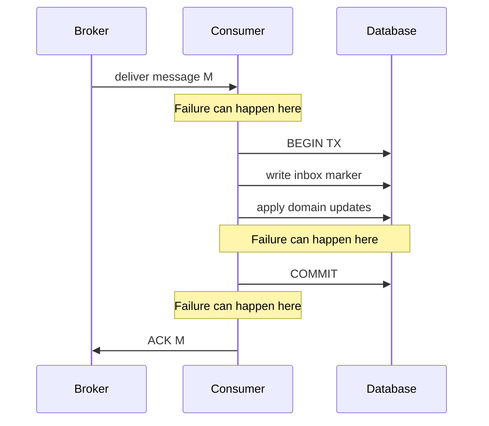
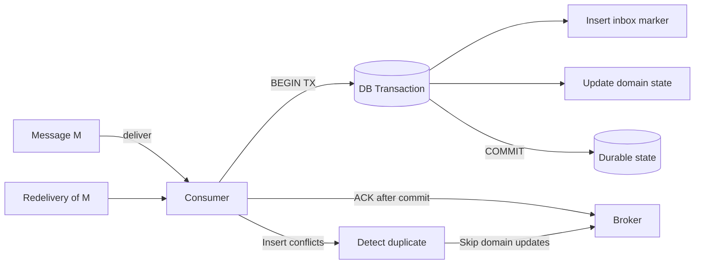

---

slug: transactional-inbox-pattern
title: Transactional Inbox Pattern
readTime: 20 min
orderIndex: 4
premium: false

---


# Transactional Inbox Pattern (a.k.a. "Transactional Message Handling") — An Interactive Deep Dive

Challenge: Your service got the message... but did it *process* it?

You run **Order Service**. It consumes events from a broker (Kafka/RabbitMQ/SQS), updates a database, and publishes follow-up events.

One morning you see:
- Customers charged: OK
- Inventory decremented: OK
- But shipping never started: FAIL

Logs show the `OrderPaid` message was consumed. Yet the database update and/or outgoing event didn’t happen consistently.

Pause and think:
- Where can failure happen between "message received" and "effects committed"?
- If the consumer crashes at exactly the wrong time, what guarantees do you actually have?

This article is about a pattern that answers those questions in a practical way: **the Transactional Inbox Pattern**.

> Key idea: Treat message handling as a *transactional* operation by writing an "inbox record" in the same database transaction as your business state changes, so retries become safe and duplicates become harmless.

---

## What you’ll learn (and why it matters)

By the end, you should be able to:
- Explain the Transactional Inbox Pattern with a crisp mental model
- Design inbox tables and processing flows for distributed environments
- Reason about failure scenarios (crash timing, duplicates, reordering)
- Compare inbox vs outbox vs "exactly-once" illusions
- Choose trade-offs: storage, throughput, latency, operational complexity
- Combine inbox with outbox for end-to-end reliable workflows

Challenge question: If your broker is at-least-once, what must your consumer do differently than "just ack after processing"?

---

## Mental model: The coffee shop "ticket stub ledger"

Scenario:
A busy coffee shop has:
- Customers shouting orders (messages)
- Baristas making drinks (business logic)
- A cashier who must prevent making the same drink twice if the customer repeats the order

Interactive question:
If the customer repeats "large latte" because they didn’t hear you, do you remake it?

Analogy:
A robust shop uses tickets:
1. Cashier writes a ticket with a unique ticket number.
2. Barista checks a ledger: "Have we fulfilled ticket #123?"
3. If yes, don’t remake; if no, make it and mark it done.

Real-world parallel:
Distributed messaging is like a noisy coffee shop: messages can be repeated, reordered, delayed, or delivered after timeouts. The inbox is your ticket ledger.

**Key insight:**
The inbox isn’t about stopping duplicates at the broker. It’s about making duplicates safe at the consumer.

---

## The core problem: "Exactly-once" is a trap (most of the time)

Typical consumer flow:
1) Receive message `M`
2) Update DB row(s)
3) Acknowledge message

Interactive question:
If the process crashes between steps 2 and 3, what happens?

Reality:
Most brokers provide **at-least-once delivery** by default:
- If you crash before ack/commit of offset, you’ll see the message again.
- If your handler isn’t idempotent, you’ll apply effects twice.

**Key insight:**
Inbox is a consumer-side technique to survive at-least-once delivery without corrupting state.

---

## Visual: Where failures happen



The dangerous window is: **DB commit succeeded, but ack didn’t**. Without a dedupe marker, the redelivery re-applies effects.

---

## Common misconception: "If we use Kafka transactions, we don’t need an inbox"

Kafka supports transactions and "exactly-once semantics" (EOS) **within Kafka** (producer idempotence + transactional writes + consumer offset commits).

Interactive question:
Can Kafka atomically commit your Postgres write and your Kafka offset commit?

Answer:
Not without a cross-system transaction coordinator (2PC) or moving state into Kafka (e.g., Kafka Streams state stores / compacted topics) or using a DB that participates in the same transaction protocol (rare in practice).

**Key insight:**
Kafka EOS does **not** automatically give exactly-once *effects* across Kafka + your database. You still need idempotency/inbox/outbox patterns.

Production note:
Even when using Kafka EOS, you still must handle:
- producer retries
- consumer rebalances
- duplicates due to timeouts
- poison messages
- out-of-order events across partitions

---

## Transactional Inbox Pattern: what it is

Definition:
A consumer persists each incoming message (or its stable unique identifier) into an **Inbox** table in the **same database transaction** as the business state changes triggered by that message.

On redelivery, the consumer detects the message via the inbox and safely skips (or returns a stored result).

Minimal flow:
1. Receive message with unique `message_id` (idempotency key)
2. Start DB transaction
3. Insert `(consumer_name, message_id)` into inbox (or upsert)
4. If insert succeeds (first time), apply business updates
5. Commit
6. Ack message

If message is redelivered:
- inbox insert conflicts -> skip business logic -> ack

**Key insight:**
The inbox is your durable "already processed" memory, stored next to your business state and committed atomically with it.

Interactive question:
Why must the inbox insert and the domain update be in the same transaction?

Answer:
Because you need a single atomic decision point: either *both* the dedupe marker and the domain effects exist, or *neither* exists. Otherwise you reintroduce a crash window.

---

## Inbox vs Outbox: don’t confuse them

Two reliability problems often get mixed up:
- "Did I process the incoming message exactly once (effectively)?" -> **Inbox**
- "Did I publish the outgoing event reliably?" -> **Outbox**

Matching exercise:
A) "We update DB and then publish an event; sometimes publish fails and downstream never hears."
B) "We consume a message; crash after DB update but before ack causes duplicates."

Answer:
- A -> Transactional Outbox
- B -> Transactional Inbox

Production reality:
Many systems need **both** inbox (safe consumption) and outbox (reliable publication) to get end-to-end correctness.

---

## Decision game: Which statement is true?

Pick the true statement(s):

1) "Inbox prevents the broker from redelivering messages."
2) "Inbox makes duplicate deliveries safe by deduplicating at the consumer."
3) "Inbox guarantees strict ordering across partitions/topics."
4) "Inbox can be implemented with a unique constraint on message_id."

Answer: **2 and 4**.

**Key insight:**
Inbox is dedupe + transactional coupling. It does not control broker delivery or ordering.

Interactive question:
What distributed systems property is the unique constraint acting as?

Answer:
A strongly consistent "first writer wins" decision *within the database* for a given `(consumer_name, message_id)` key.

---

## Designing the Inbox table

You need a schema that supports:
- dedupe
- debugging
- retention management
- multi-handler isolation (optional)

Interactive question:
Should the dedupe key be global, per topic, or per handler?

Rule of thumb:
- If multiple handlers can legitimately process the same message independently, scope dedupe **per handler**.
- If a message must be processed only once across the whole service, scope dedupe **per service**.

### Recommended schema (Postgres)

```sql
-- Inbox table: one row per (consumer/handler, message_id)
CREATE TABLE inbox (
  consumer_name  text        NOT NULL,
  message_id     uuid        NOT NULL,
  source         text        NOT NULL,
  received_at    timestamptz NOT NULL DEFAULT now(),
  processed_at   timestamptz NOT NULL DEFAULT now(),
  payload_hash   bytea,
  -- optional: store minimal metadata for debugging
  headers        jsonb,
  PRIMARY KEY (consumer_name, message_id)
);

CREATE INDEX inbox_processed_at_idx ON inbox (processed_at);
```

Notes:
- `processed_at` is set on insert; you can also keep `received_at` separate if you want.
- `headers` is optional but useful for tracing (correlation IDs, partition/offset, etc.).
- If `message_id` is not a UUID in your system, use `text` and enforce format at the edge.

---

## Visual: The atomicity you’re buying



---

## Step-by-step flow with failure points (and the correct ack placement)

Interactive question:
Where should ack occur relative to DB commit?

Answer:
Ack should happen **after** the DB transaction commits successfully.

### Correct Python example (psycopg3)

Key fixes vs many naive examples:
- **Never ack inside the DB transaction** (if ack succeeds but commit fails, you lose the message).
- Don’t call `conn.rollback()` inside `with conn.transaction()`; the context manager handles rollback.
- Treat unique-constraint conflict as "already processed".

```python
import json
import hashlib
import psycopg

class Broker:
    def ack(self, msg: dict) -> None: ...
    def nack(self, msg: dict, requeue: bool = True) -> None: ...


def handle_order_paid(conn: psycopg.Connection, broker: Broker, msg: dict) -> None:
    """Process OrderPaid with dedupe via inbox row; safe under at-least-once delivery."""

    # Stable serialization for hashing/debugging (not required for dedupe)
    payload = json.dumps(msg, sort_keys=True, separators=(",", ":")).encode("utf-8")
    payload_hash = hashlib.sha256(payload).digest()

    try:
        with conn.transaction():
            inserted = conn.execute(
                """
                INSERT INTO inbox (consumer_name, message_id, source, payload_hash)
                VALUES (%s, %s, %s, %s)
                ON CONFLICT (consumer_name, message_id) DO NOTHING
                RETURNING 1
                """,
                ("order-service", msg["id"], msg.get("source", "broker"), payload_hash),
            ).fetchone()

            if inserted is None:
                # Duplicate delivery: domain effects already committed in a prior attempt.
                pass
            else:
                updated = conn.execute(
                    "UPDATE orders SET paid = true, paid_amount = %s WHERE id = %s",
                    (msg["amount"], msg["order_id"]),
                ).rowcount
                if updated != 1:
                    raise ValueError(f"Order not found: order_id={msg['order_id']}")

        # Commit succeeded if we got here.
        broker.ack(msg)

    except (psycopg.Error, ValueError):
        # Decide retry vs DLQ based on error classification.
        broker.nack(msg, requeue=True)
        raise
```

### Failure point analysis

1) Crash before DB transaction starts -> broker redelivers -> safe.

2) Crash after inbox insert but before commit -> transaction rolls back -> broker redelivers -> safe.

3) Crash after domain update but before commit -> transaction rolls back -> broker redelivers -> safe.

4) Crash after commit but before ack -> broker redelivers -> inbox conflict -> skip domain updates -> safe.

**Key insight:**
The critical crash window is "commit succeeded, ack didn’t." Inbox turns that into a harmless retry.

---

## Handling "same ID, different payload" (data integrity incident)

If a producer reuses IDs incorrectly, you can silently drop a *different* message as a "duplicate." That’s a serious integrity bug.

Mitigation: store a payload hash and detect mismatches.

### SQL (requires pgcrypto)

```sql
-- One-time setup
CREATE EXTENSION IF NOT EXISTS pgcrypto;

-- Insert or detect mismatch
WITH upsert AS (
  INSERT INTO inbox (consumer_name, message_id, source, payload_hash)
  VALUES ($1, $2, $3, digest($4, 'sha256'))
  ON CONFLICT (consumer_name, message_id)
  DO UPDATE SET processed_at = inbox.processed_at
  RETURNING payload_hash
)
SELECT (payload_hash = digest($4, 'sha256')) AS same_payload
FROM upsert;
```

Production note:
- If `same_payload = false`, treat it as a security/integrity incident: alert, quarantine, and route to DLQ.

---

## Cleanup and retention operations

Inbox grows forever unless you manage retention.

### Simple deletion job

```sql
DELETE FROM inbox
WHERE processed_at < now() - interval '30 days';
```

### Batched deletes (avoid long locks / bloat)

```python
import psycopg

def cleanup_inbox(conn: psycopg.Connection, older_than_days: int = 30, batch: int = 5000) -> int:
    """Deletes old inbox rows in batches; returns total deleted."""
    total = 0
    while True:
        with conn.transaction():
            deleted = conn.execute(
                """
                WITH doomed AS (
                  SELECT consumer_name, message_id
                  FROM inbox
                  WHERE processed_at < now() - (%s || ' days')::interval
                  ORDER BY processed_at
                  LIMIT %s
                )
                DELETE FROM inbox i
                USING doomed d
                WHERE i.consumer_name = d.consumer_name AND i.message_id = d.message_id
                RETURNING 1
                """,
                (older_than_days, batch),
            ).rowcount
        total += deleted
        if deleted == 0:
            return total
```

Production insights:
- Prefer time partitioning (monthly partitions) for high volume; then retention is `DROP PARTITION` (fast).
- Monitor table bloat; schedule VACUUM/autovacuum appropriately.
- Retention must be at least the maximum replay window you might trigger (e.g., reprocessing from offsets, DLQ re-drive).

---

## Concurrency and ordering: what inbox does and doesn’t do

Inbox dedupes duplicates; it does **not** solve:
- out-of-order delivery
- concurrent updates to the same aggregate
- cross-partition ordering

If ordering matters, you need additional mechanisms:
- per-aggregate sequencing (version numbers)
- optimistic concurrency control (OCC)
- or serialize processing per key (e.g., Kafka partitioning by order_id)

### OCC example (SQL)

```sql
UPDATE orders
SET status = $1, version = version + 1
WHERE id = $2 AND version = $3;
```

### Node.js example (pg) with inbox + OCC

```javascript
import pg from "pg";

export async function handleStatusUpdate(pool, broker, msg) {
  const client = await pool.connect();
  try {
    await client.query("BEGIN");

    const ins = await client.query(
      `INSERT INTO inbox (consumer_name, message_id, source)
       VALUES ($1,$2,$3)
       ON CONFLICT (consumer_name, message_id) DO NOTHING
       RETURNING 1`,
      ["order-service", msg.id, msg.source || "broker"]
    );

    if (ins.rowCount === 0) {
      await client.query("COMMIT");
      broker.ack(msg);
      return;
    }

    const upd = await client.query(
      `UPDATE orders
       SET status=$1, version=version+1
       WHERE id=$2 AND version=$3`,
      [msg.status, msg.orderId, msg.expectedVersion]
    );

    if (upd.rowCount !== 1) {
      throw new Error("Version conflict (out-of-order event)");
    }

    await client.query("COMMIT");
    broker.ack(msg);

  } catch (e) {
    await client.query("ROLLBACK");
    broker.nack(msg, { requeue: true });
    throw e;
  } finally {
    client.release();
  }
}
```

Production note:
- If you partition messages by `orderId` in Kafka, you often get per-order ordering within a partition. Rebalances and retries can still cause duplicates.

---

## External side effects: payments, emails, HTTP calls

Inbox makes **database effects** idempotent. It does not automatically make **external side effects** idempotent.

Options:
1) Use an external API that supports idempotency keys (best).
2) Use an outbox + async worker to perform side effects.
3) Store a "side effect executed" marker in DB (similar to inbox) and ensure exactly-once per side effect.

### TypeScript: idempotent external call

```ts
import { setTimeout as delay } from "node:timers/promises";

type Msg = { id: string; customerId: string; amount: number };

type Payments = {
  charge(input: { customerId: string; amount: number; currency: string; idempotencyKey: string }): Promise<void>;
};

export async function chargeWithIdempotency(payments: Payments, msg: Msg): Promise<void> {
  const idempotencyKey = `order-paid:${msg.id}`;
  try {
    await payments.charge({ customerId: msg.customerId, amount: msg.amount, currency: "USD", idempotencyKey });
  } catch (err) {
    await delay(250);
    throw new Error(`Payment charge failed (idempotencyKey=${idempotencyKey}): ${String(err)}`);
  }
}
```

---

## Distributed systems rigor: assumptions, CAP, and failure modes

### Network and failure assumptions

Assume:
- The network can drop, delay, duplicate, and reorder packets.
- The broker can redeliver messages (at-least-once).
- The consumer can crash at any point.
- The database can fail, restart, or temporarily reject writes.

### CAP implications (practical view)

Your consumer depends on the database transaction to decide "processed or not." Under a network partition between consumer and DB:
- You cannot safely process new messages (you can’t write the inbox marker).
- If you keep consuming anyway, you risk violating correctness.

So in practice, the inbox pattern chooses:
- Consistency of processing decisions (no double-apply)
- Partition tolerance (system must handle partitions)
- at the cost of Availability during DB unreachability (you should stop/slow consumption, or buffer)

This is the right trade-off for most financial/order workflows.

### Consistency model

Within a single DB, the unique constraint provides a strongly consistent decision for a given key.
Across systems (broker + DB), you still have eventual consistency: ack and commit are not atomic together.

Inbox converts that cross-system gap into a safe retry.

---

## Performance considerations and trade-offs

### Costs
- Extra write per message (inbox insert/upsert)
- Index maintenance on `(consumer_name, message_id)`
- Storage growth + retention jobs

### Benefits
- Correctness under at-least-once delivery
- Simple operational model (no distributed transactions)
- Works with any broker

### Throughput tips
- Keep inbox row small (avoid storing full payload unless required).
- Use `bytea` hash + minimal metadata.
- Batch consumption, but keep DB transactions reasonably small.
- Consider partitioning inbox by time for high volume.
- If using Kafka, align consumer concurrency with partition count; avoid multiple consumers processing the same partition concurrently.

### Trade-off analysis
- Inbox vs pure idempotent domain logic:
  - Pure idempotency can work but is often harder to prove and maintain.
  - Inbox gives a generic, auditable dedupe mechanism.
- Inbox vs broker-side exactly-once:
  - Broker EOS doesn’t cover DB side effects.
  - Inbox is broker-agnostic and DB-centric.
- Inbox retention window:
  - Too short: replay can re-apply effects.
  - Too long: storage and index bloat.

---

## Testing strategy (fault injection)

You want to prove:
- duplicates don’t double-apply
- crash windows are safe
- concurrency doesn’t break invariants

### Concurrent duplicate delivery test harness

```python
import threading
from concurrent.futures import ThreadPoolExecutor

def run_duplicate_race(handler, msg, workers: int = 10) -> None:
    """Calls handler concurrently with the same message to validate dedupe."""
    errors = []
    lock = threading.Lock()

    def call():
        try:
            handler(msg)
        except Exception as e:
            with lock:
                errors.append(e)

    with ThreadPoolExecutor(max_workers=workers) as ex:
        for _ in range(workers):
            ex.submit(call)

    if errors:
        raise RuntimeError(f"Handler failed under duplicate race: {errors[0]}")
```

Production-grade additions:
- Kill -9 the consumer between commit and ack (simulate crash window #4).
- Inject DB timeouts / serialization failures.
- Validate DLQ behavior for poison messages.

---

## Production failure scenarios checklist

1) DB unavailable / partitioned
   - Symptom: inbox insert fails
   - Action: stop/slow consumption; rely on broker retention; alert

2) Poison message (always fails domain validation)
   - Symptom: infinite retries
   - Action: retry budget + DLQ; include reason and payload hash

3) Duplicate deliveries (normal)
   - Symptom: repeated message IDs
   - Action: inbox conflict -> skip; track duplicate rate as a metric

4) Producer bug: ID reuse with different payload
   - Symptom: payload hash mismatch
   - Action: alert + quarantine; do not silently ack

5) Out-of-order events
   - Symptom: OCC version conflict
   - Action: retry later, buffer until missing versions arrive, or design state machine tolerant to reordering

---

## Final synthesis challenge: Design the inbox for a Delivery Platform

One solid solution:
1) Dedupe key: stable `(scanner_id, scan_id)` or producer-generated UUID stable across retries
2) Transaction: insert inbox row; update packages with version check; insert outbox event; commit; ack
3) Retention: at least as long as you might replay scans (e.g., 30-90 days), ideally partitioned monthly
4) Inbox doesn’t solve: out-of-order scans (needs versioning), external notifications (need idempotency/outbox), producer ID reuse bugs

---

## Key takeaways

- At-least-once delivery is normal; duplicates are inevitable.
- Inbox makes duplicates safe by recording "already processed" in the same transaction as domain updates.
- Ack after commit; never ack inside the DB transaction.
- Inbox does not solve ordering or external side effects; pair with OCC, partitioning, idempotency keys, and often an outbox.
